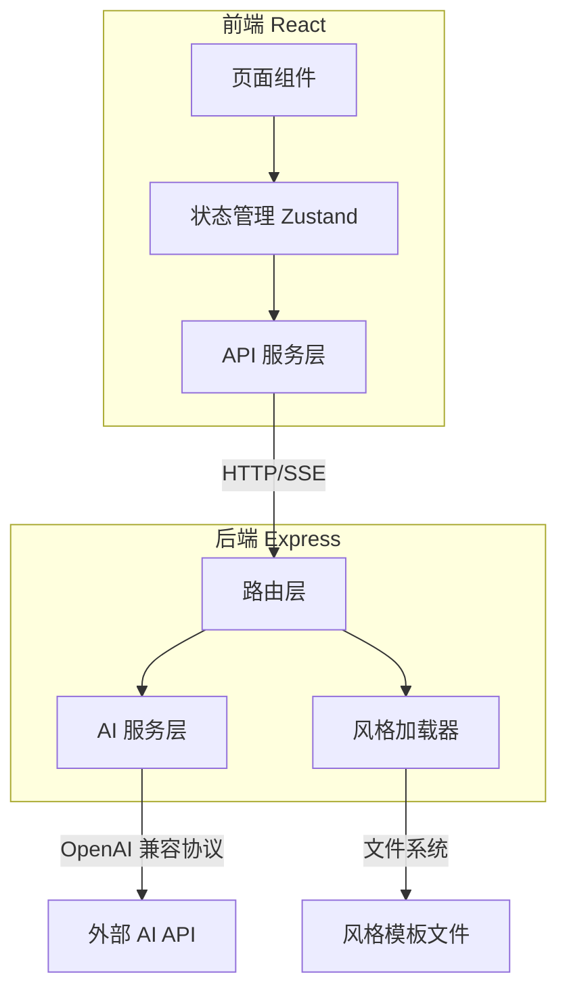

## 1. 架构设计



## 2. 技术说明

- **前端**：React@18 + TypeScript + Tailwind CSS@3 + Vite
- **初始化工具**：vite-init (react-express-ts 模板)
- **后端**：Express@4 + TypeScript (ESM)
- **状态管理**：Zustand
- **图标库**：lucide-react
- **Markdown 渲染**：marked
- **数据库**：无（API Key 存储在浏览器 localStorage）

## 3. 路由定义

| 路由 | 用途 |
|------|------|
| `/` | 创作工作台（单页应用） |

## 4. API 定义

### 4.1 获取写作风格

```
GET /api/styles
Response: { styles: Array<{ id: string; name: string }> }
```

### 4.2 生成正文（SSE 流式）

```
POST /api/article
Body: { topic: string; styleId: string; apiUrl: string; apiKey: string; modelName: string }
Response: text/event-stream
  data: { content: string }
  data: [DONE]
```

### 4.3 生成标题摘要

```
POST /api/titles
Body: { article: string; apiUrl: string; apiKey: string; modelName: string }
Response: { titles: Array<{ title: string; summary: string }> }
```

### 4.4 生成封面 Prompt

```
POST /api/cover/prompts
Body: { article: string; apiUrl: string; apiKey: string; modelName: string }
Response: { keyPoints: string[]; prompts: string[] }
```

### 4.5 生成封面图

```
POST /api/cover/generate
Body: { prompt: string; apiUrl: string; apiKey: string; modelName: string }
Response: { url?: string; b64_json?: string; revised_prompt: string }
```

### 4.6 图片代理（显示）

```
GET /api/cover/proxy?url=<encoded_url>
Response: image/*
```

### 4.7 图片代理（下载）

```
POST /api/cover/proxy
Body: { imageUrl: string }
Response: image/*
```

## 5. 服务端架构图

```mermaid
flowchart LR
    "Router" --> "AI Service"
    "Router" --> "Style Loader"
    "AI Service" --> "OpenAI Compatible API"
    "AI Service" --> "DashScope API"
    "Style Loader" --> "styles/*.txt"
```

## 6. 数据模型

不适用（无数据库，所有配置存储在浏览器 localStorage）

### 风格模板文件格式

```
styles/
  └── {风格名称}.txt   # 文件名即风格名称，内容为 Prompt 指令
```
